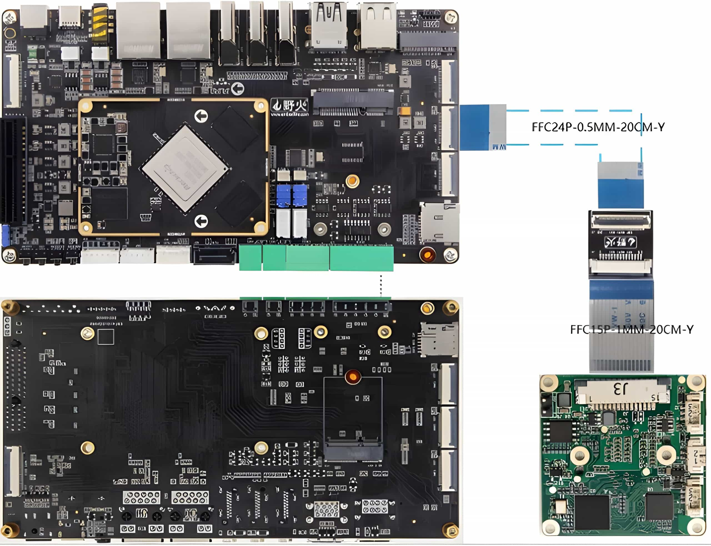

# How to use VEYE series cameras on LubanCat-5-BTB RK35XX board
This is a mirror of [our wiki article](https://wiki.veye.cc/index.php?title=VEYE_CS_Camera_on_Lubancat_Boards).

[toc]

## Overview
VEYE series cameras are the video streaming mode MIPI cameras we designed. This article takes LubanCat-5-BTB board as an example to introduce how to connect VEYE series cameras to RK3566/RK3568/RK3588 system.

We provide drivers for Linux.

## Camera Module List

| Series  | Model  | Status  |
| ------------ | ------------ | ------------ |
| VEYE Series  | VEYE-MIPI-IMX327S  | Done  |
| VEYE Series  | VEYE-MIPI-IMX462  | Done  |
| VEYE Series  | VEYE-MIPI-IMX385  | Done  |

## Hardware Setup
LubanCat-5-BTB provides a 22-pin connector compatible with Raspberry Pi, allowing our camera to be installed on its motherboard without the need for an adapter board.

### Connection of Camera and LubanCat-5-BTB Board
Both use a 15-to-22-pin FFC cable for connection, ensuring that the silver contact surface faces outward.



## Introduction to github repositories
https://github.com/veyeimaging/rk35xx_veye_bsp
https://github.com/veyeimaging/rk35xx_lubancat
includes：
- driver source code
- i2c toolkits
- application demo

In addition, a compiled linux kernel installation package and Android image is provided in the releases.

## Upgrade LubanCat-5-BTB Debain system
### Overview
This chapter describes how to update the RK35xx system to support our camera modules. We provide the official LubanCat-5-BTB image and a .deb installation package for direct installation.

This chapter describes how to update the RK35xx system to support our camera modules. We provide the official LubanCat-5-BTB image and a .deb installation package for direct installation. Please note that our Debian package is built specifically for the official image lubancat-rk3588-debian12-gnome-20260113_update.img (Extraction Code: hslu). Before using the dpkg command to install the .deb package, please verify your current operating system version.

### Using prebuilt Image and dtb file
Using the compiled debain installation package

On the RK35xx board,
Download the latest debs.tar.gz from https://github.com/veyeimaging/rk35xx_LubanCat/releases/ .


```shell
tar -xavf debs.tar.gz

cd debs

sudo dpkg -i linux-headers-6.1.99-rk3588_6.1.99-rk3588-61_arm64.deb

sudo dpkg -i linux-image-6.1.99-rk3588_6.1.99-rk3588-61_arm64.deb

sudo reboot
```
If the version does not match, it needs to be compiled from the source code.

### Modify the Device Tree Overlay Configuration File
After installing the Debian package, you can dynamically enable a camera on any CAM interface by modifying the configuration file.

Note: Each CAM interface supports only one camera type at a time.

A system reboot is required for the changes to take effect.

File Path:
```
/boot/uEnv/uEnv.txt
```

Example: Enabling the Veyecam on the CAM4 Interface.
```shell
# cam4

#dtoverlay=/dtb/overlay/rk3588-lubancat-5io-cam4-imx415-3840x2160-15fps-overlay.dtbo

#dtoverlay=/dtb/overlay/rk3588-lubancat-5io-cam4-imx415-1920x1080-60fps-overlay.dtbo

#dtoverlay=/dtb/overlay/rk3588-lubancat-5io-cam4-ov8858-3264x2448-15fps-overlay.dtbo

#dtoverlay=/dtb/overlay/rk3588-lubancat-5io-cam4-ov8858-1632x1224-30fps-overlay.dtbo

#dtoverlay=/dtb/overlay/rk3588-lubancat-5io-cam4-gc08a8-3264x2448-30fps-overlay.dtbo

#dtoverlay=/dtb/overlay/rk3588-lubancat-5io-cam4-gc2053-1920x1080-30fps-overlay.dtbo

#dtoverlay=/dtb/overlay/rk3588-lubancat-5io-cam4-gc4653-2560x1440-30fps-overlay.dtbo

#dtoverlay=/dtb/overlay/rk3588-lubancat-5io-cam4-gxcam-overlay.dtbo

dtoverlay=/dtb/overlay/rk3588-lubancat-5io-cam4-mvcam-overlay.dtbo

#dtoverlay=/dtb/overlay/rk3588-lubancat-5io-cam4-veyecam2m-overlay.dtbo

sudo reboot

```
### Device Node Description
When all six CAM interfaces are enabled simultaneously, the corresponding device nodes are mapped as follows:

| CAM num | media node | video node |
| ------------ | ------------ | ------------ |
| cam0 | /dev/media0 | /dev/video0 |
| cam1 | /dev/media1 | /dev/video11 |
| cam2 | /dev/media2 | /dev/video22 |
| cam3 | /dev/media3 | /dev/video33 |
| cam4 | /dev/media4 | /dev/video44 |
| cam5 | /dev/media5 | /dev/video55 |

Note: When 1 to 5 interfaces are enabled, the mapping between cameras and device nodes is not fixed. Please use the media-ctl command to check the actual mapping.

Example: To check the camera corresponding to /dev/media1. Since the media-ctl command generates extensive output, you can quickly view the mapping by displaying only the first 20 and last 20 lines of the output.
media-ctl -p -d /dev/media2 | head -n 20; media-ctl -p -d /dev/media2 | tail -n 20

Output:
```
Media controller API version 6.1.99

Media device information

driver          rkcif

model           rkcif-mipi-lvds2

serial

bus info        platform:rkcif-mipi-lvds2

hw revision     0x0

driver version  6.1.99

Device topology

     -entity 1: stream_cif_mipi_id0 (1 pad, 11 links)

            type Node subtype V4L flags 0

            device node name /dev/video22

        pad0: Sink

                <- "rockchip-mipi-csi2":1 [ENABLED]

                <- "rockchip-mipi-csi2":2 []

                <- "rockchip-mipi-csi2":3 []

                <- "rockchip-mipi-csi2":4 []

                -> "rkcif_tools_id0":0 []

                -> "rkcif_tools_id1":0 []

                -> "rkcif_tools_id2":0 [ENABLED]

          -entity 58: rockchip-csi2-dphy1 (2 pads, 2 links)

             type V4L2 subdev subtype Unknown flags 0

             device node name /dev/v4l-subdev1

        pad0: Sink

                [fmt:UYVY8_2X8/1920x1080@10000/300000 field:none]

                <- "m00_b_veyecam2m 2-003b":0 [ENABLED]

        pad1: Source

                -> "rockchip-mipi-csi2":0 [ENABLED]

          -entity 63: m00_b_veyecam2m 2-003b (1 pad, 1 link)

             type V4L2 subdev subtype Sensor flags 0

             device node name /dev/v4l-subdev2

        pad0: Source

                [fmt:UYVY8_2X8/1920x1080@10000/300000 field:none]

                -> "rockchip-csi2-dphy1":0 [ENABLED]
```
/dev/media2 corresponds to /dev/video22 and m00_b_veyecam2m 2-003b. The digit 2 in m00_b_veyecam2m 2-003b represents the I2C bus ID. The table below lists the I2C bus IDs assigned to each CAM interface.

| CAM num | I2C node |
| ------------ | ------------ |
| cam0 | i2c0 | 
| cam1 | i2c1 |
| cam2 | i2c2 |
| cam3 | i2c3 |
| cam4 | i2c4 |
| cam5 | i2c5 |

Based on this, it can be determined that m00_b_gxcam 2-003b is the camera entity name for the CAM2 interface.
### Hardware Interface Testing and Signal Optimization Recommendations
Through hardware testing, it has been observed that using the CAM0 and CAM1 interfaces may result in frame loss during data transmission. To ensure optimal image acquisition quality, it is recommended to prioritize the use of other available ports for camera connection and evaluation testing.

- Root Cause Analysis:
In the current evaluation setup, an additional 24P-to-15P adapter board is used between the LubanCat-5-BTB and the camera. This adapter board introduces MIPI signal trace stubs, which can cause signal reflections and subsequently degrade MIPI signal integrity.

- Design Recommendations:
For formal product design phases, it is recommended to eliminate this adapter board by directly integrating the carrier board design with the camera interface specifications.

### Check system status
Run the following command to confirm whether the camera is probed.
- VEYE-MIPI-XXX
`dmesg | grep veye`
The output message appears as shown below：
```
veyecam2m 2-003b:  camera id is veyecam2m

veyecam2m 2-003b: sensor is IMX327
```
- Run the following command to check the presence of video node.

`ls /dev/video0`

The output message appears as shown below.

`video0`

For LubanCat-5-BTB, the camera is connected to i2c-2.

## Samples
### v4l2-ctl

#### Install v4l2-utils

`sudo apt-get install v4l-utils`

####  List the data formats supported by the camera

`v4l2-ctl --list-formats-ext`

#### Snap YUV picture

`v4l2-ctl --set-fmt-video=width=1920,height=1080,pixelformat='NV12' --stream-mmap --stream-count=100 --stream-to=nv12-1920x1080.yuv`

For RK3566, also:
`v4l2-ctl --set-fmt-video=width=1920,height=1080,pixelformat=UYVY --stream-mmap --stream-count=1 --stream-to=uyvy-1920x1080.yuv`

You can use software like YUV Player or Vooya to play the images.

#### Check frame rate
`v4l2-ctl --set-fmt-video=width=1920,height=1080,pixelformat=NV12 --stream-mmap --stream-count=-1 --stream-to=/dev/null`

### Installing Yavta
Download the source code of yavta
```
https://github.com/veyeimaging/yavta

cd yavta;make

./yavta -c1 -Fnv12-1920x1080.yuv --skip 0 -f NV12 -s 1920x1080 /dev/video0
```

### gstreamer
We provide several gstreamer routines that implement the preview, capture, and video recording functions. See the [samples](https://github.com/veyeimaging/rk35xx_veye_bsp/tree/main/samples) directory on github for details.

### Import to OpenCV

First install OpenCV:
`sudo apt install python3-opencv`

We provide several routines to import camera data into opencv. See the [samples](https://github.com/veyeimaging/rk35xx_veye_bsp/tree/main/samples) directory on github for details.

## i2c script for parameter configuration

Because of the high degree of freedom of our camera parameters, we do not use V4L2 parameters to control, but use scripts to configure parameters.

https://github.com/veyeimaging/rk35xx_veye_bsp/tree/main/i2c_cmd

using -b option to identify which bus you want to use.

- VEYE series
Video Control Toolkits Manual ：[VEYE-MIPI-327 I2C](http://wiki.veye.cc/index.php/VEYE-MIPI-290/327_i2c/)

##  Compile drivers and dtb from source code
https://github.com/veyeimaging/rk35xx_LubanCat/blob/main/linux/

## References

- LubanCat-5-BTB Manual
https://doc.embedfire.com/linux/rk3588/quick_start/zh/latest/index.html

## Document History
- 2026-06-10
Release 1st version.
